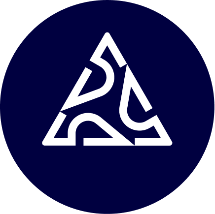
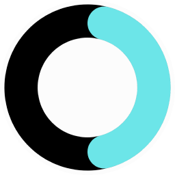
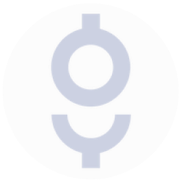
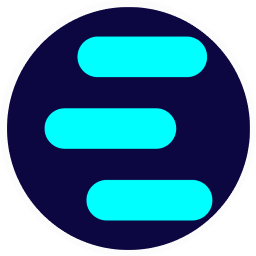
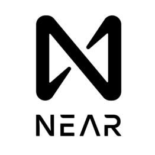
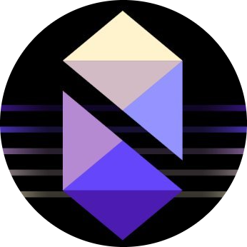
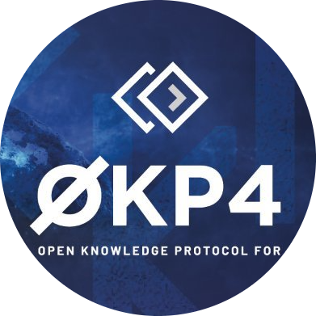
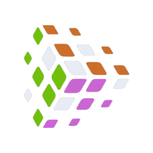

  

VALIDATOR PROFILE

  

<h2 align="center">Mainnets</h2>

<h2 align="center">Testnets</h2>

<h2 align="center">Contact Us</h2>

<h2 align="center">Statistic</h2

 

<h2 align="center">Languages and Tools</h2>

  

  

comming soon...
