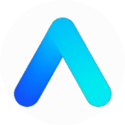
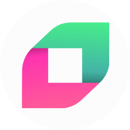
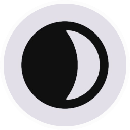
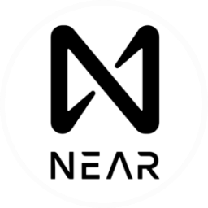
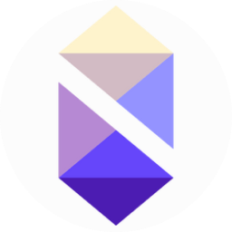
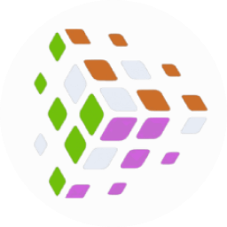

  

VALIDATOR PROFILE

  

<h2 align="center">Mainnets</h2>

<h2 align="center">Testnets</h2>

<h2 align="center">🌐 Contact Us</h2>

<h2 align="center">📊 Statistic</h2

 
 

<h2 align="center">💻 Tech Stack</h2>

  

 
 
 
 
 
 
 
 
 
 
 
 
 
 
 
 
 
 
 
 
 
 
 

  

<h2 align="center">🏆 GitHub Trophies</h2>

  

<h2 align="center">🐦 Latest Tweet</h2>

  

comming soon...
