

  

### VALIDATOR PROFILE

  

## Mainnets

<a href="https://explorer.nymtech.net/network-components/mixnode/1046" target="_black">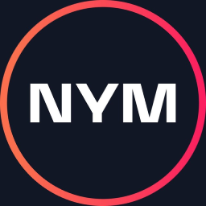</a>

<a href="https://explorer.ksalab.xyz/sgenet-1/staking/sgevaloper1e4n6enpatpe0a3eqw6gzcpgq2vgd9a3zcg8ffl" target="_blank">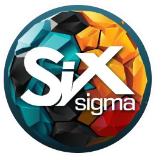</a>

## Testnets

<a href="#" target="_blank">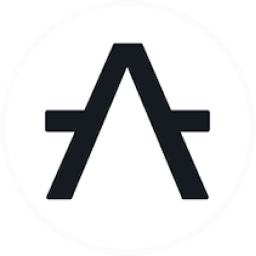</a>
<a href="https://explorer.ksalab.xyz/althea/staking/altheavaloper14sazswzv2hvtkmsd8tzqzn99saujumqccgp8yt" target="_blank">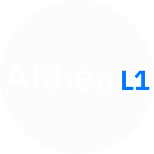</a>

<a href="#" target="_blank">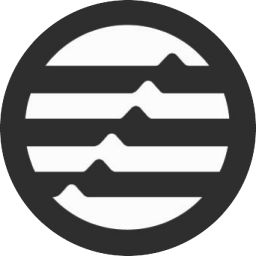</a>

<a href="https://explorer.ksalab.xyz/arkeo/staking/tarkeovaloper1qznu5t6w3m8qfcx5evj96vnz7w57hndqyx9jva" target="_blank">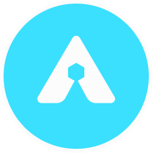</a>
<a href="https://goldberg.avail.tools/#/staking" target="_blank">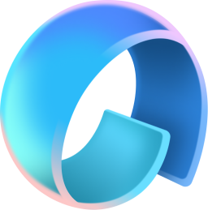</a>

<a href="#" target="_blank">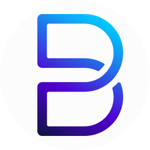</a>
<a href="#" target="_blank">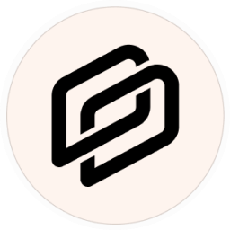</a>
<a href="https://explorer.ksalab.xyz/cascadia_6102-1/staking/cascadiavaloper1lpvdzmc30540y266djnlm9jwmakwzw2yu759jf" target="_blank">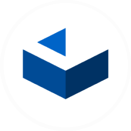</a>

<a href="#" target="_blank">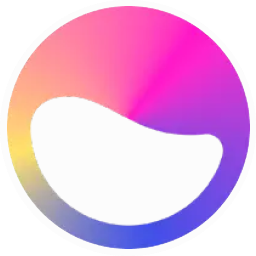</a>

<a href="https://github.com/ksalab/nodes/blob/main/node/gitopia.md" target="_blank">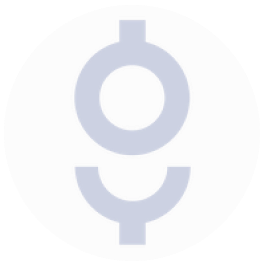</a>
<a href="#" target="_blank">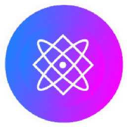</a>
<a href="#" target="_blank">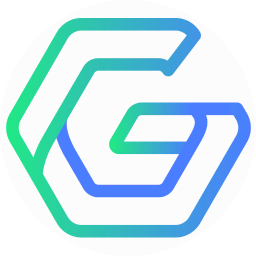</a>

<a href="https://explorer.ksalab.xyz/mande-testnet-2/staking/mandevaloper18gudsfnsk8qcnhhludfjjurswrua227xs69ewl" target="_blank">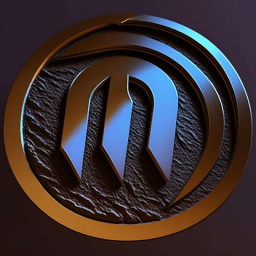</a>
<a href="#" target="_blank">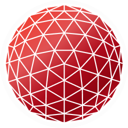</a>

<a href="#" target="_blank">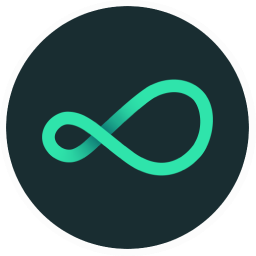</a>

<a href="#" target="_blank">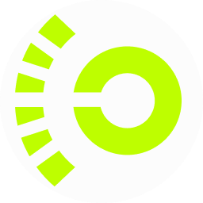</a>
<a href="#" target="_blank">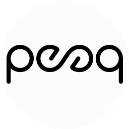</a>

<a href="#" target="_blank">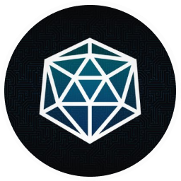</a>

<a href="#" target="_blank">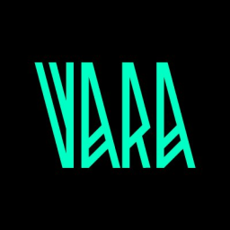</a>
<a href="#" target="_blank">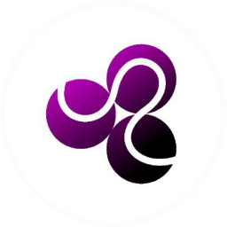</a>

## 🌐 Contact Us

## 📊 Statistic

## 💻 Tech Stack

## 🏆 GitHub Trophies

## 🐦 Latest Blog

comming soon...
