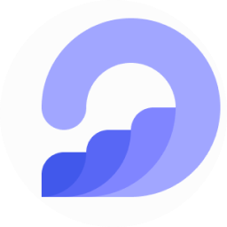
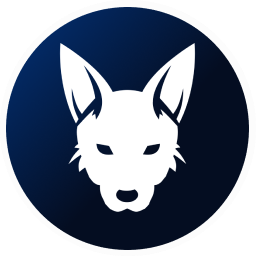
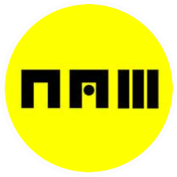
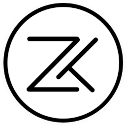

  

### VALIDATOR PROFILE

## Mainnets

## Testnets

## Archive

## 🌐 Contact Us

## 📊 Statistic

## 💻 Tech Stack

 

## 🏆 GitHub Trophies

## Latest Articles

### ✍️ Random Dev Quote

---

comming soon...
